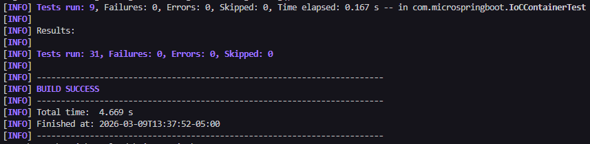
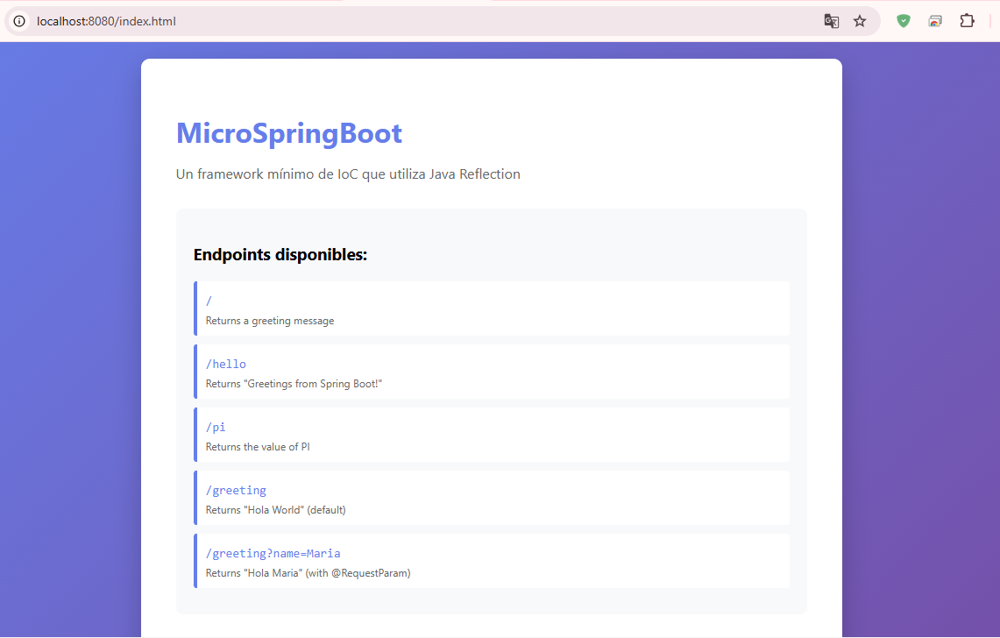
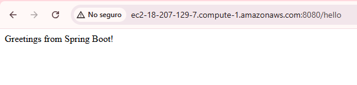
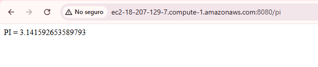
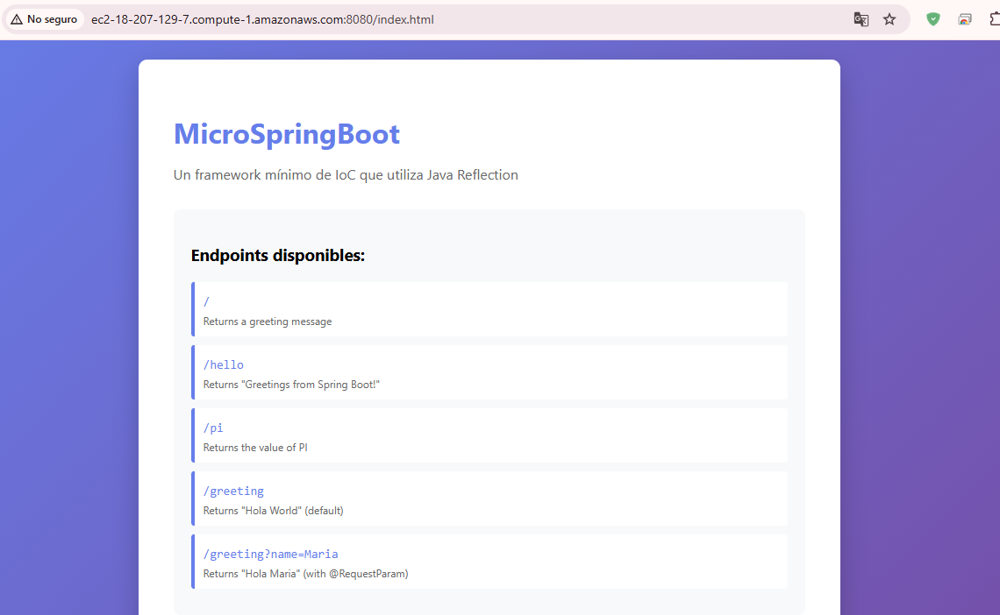

# MicroSpringBoot

Un framework mínimo de Inversión de Control (IoC) construido con Reflexión en Java, inspirado en el funcionamiento básico de Spring Boot.

## Descripción del proyecto

Este proyecto implementa un servidor web ligero con un framework IoC personalizado, utilizando la API de reflexión de Java. Fue desarrollado como un taller universitario para demostrar la comprensión de los siguientes conceptos:

- API de Reflexión en Java
- Anotaciones personalizadas
- Patrón Inversión de Control (IoC)
- Conceptos básicos del protocolo HTTP
- Estructura de proyectos con Maven

El sistema permite crear aplicaciones web a partir de POJOs (Plain Old Java Objects) anotados con metadatos, que son detectados automáticamente mediante reflexión.

## Arquitectura

### Visión General

```
┌─────────────────────────────────────────────────────────────┐
│                    MicroSpringBoot                          │
│                    (Main Entry Point)                       │
└─────────────────────┬───────────────────────────────────────┘
                      │
          ┌───────────┴───────────┐
          ▼                       ▼
┌─────────────────┐     ┌─────────────────┐
│ ClasspathScanner│     │   HttpServer    │
│                 │     │   (Port 8080)   │
└────────┬────────┘     └────────┬────────┘
         │                       │
         ▼                       ▼
┌─────────────────┐     ┌─────────────────┐
│  IoCContainer   │◄────│  StaticFile     │
│                 │     │  Handler        │
└────────┬────────┘     └─────────────────┘
         │
         ▼
┌─────────────────────────────────────────┐
│            Controllers (POJOs)          │
│  ┌───────────────┐  ┌─────────────────┐ │
│  │HelloController│  │GreetingController│
│  └───────────────┘  └─────────────────┘ │
└─────────────────────────────────────────┘
```

### Componentes

#### 1. Web Server (`HttpServer.java`)
- Servidor HTTP basado en sockets
- Escucha solicitudes en el puerto 8080
- Maneja las solicitudes de forma secuencial (no concurrente)
- Analiza las solicitudes HTTP entrantes
- Extrae la URI y los parámetros de consulta
- Redirige las solicitudes a los controladores o sirve archivos estáticos

#### 2. Contenedor IoC (`IoCContainer.java`)
- Gestiona las instancias de los controladores (ciclo de vida de los POJOs)
- Registra las rutas URI → Método
- Utiliza reflexión para invocar métodos de los controladores
- Maneja la inyección de parámetros mediante @RequestParam

#### 3. Escáner de Classpath (`ClasspathScanner.java`)
- Explora los paquetes buscando clases anotadas con @RestController
- Utiliza Class.forName() para cargar clases dinámicamente
- Permite cargar controladores manualmente desde la línea de comandos

#### 4. Anotaciones personalizadas
- `@RestController` - Marca una clase como un controlador web
- `@GetMapping` - Define la ruta HTTP que será atendida por un método
- `@RequestParam` - Permite extraer parámetros de la URL y pasarlos como argumentos al método

#### 5. Manejador de Archivos Estáticos (`StaticFileHandler.java`)
- Sirve archivos estáticos desde `resources/static/`
- Soporta múltiples formatos: HTML, PNG, CSS, JS
- Devuelve el Content-Type adecuado para cada tipo de archivo
  
### Flujo de una Solicitud HTTP

```
HTTP Request → HttpServer → Parse Request → Check Route
                                               │
                    ┌──────────────────────────┴──────────────────────────┐
                    ▼                                                      ▼
            Route Exists?                                           Serve Static File
                    │                                                      │
                    ▼                                                      ▼
            IoCContainer.invokeRoute()                            StaticFileHandler.serve()
                    │                                                      │
                    ▼                                                      ▼
            Reflection: method.invoke()                           Read file from resources
                    │                                                      │
                    └──────────────────────────┬──────────────────────────┘
                                               ▼
                                        HTTP Response
```

## Estructura del Proyecto

```
microspringboot/
├── pom.xml
├── README.md
├── .gitignore
└── docs/
    ├──img/                                   # Images
└── src/
    ├── main/
    │   ├── java/
    │   │   └── com/microspringboot/
    │   │       ├── MicroSpringBoot.java      # Main entry point
    │   │       ├── HttpServer.java           # HTTP server
    │   │       ├── HttpRequest.java          # Request model
    │   │       ├── HttpResponse.java         # Response model
    │   │       ├── IoCContainer.java         # IoC container
    │   │       ├── ClasspathScanner.java     # Classpath scanner
    │   │       ├── StaticFileHandler.java    # Static file handler
    │   │       ├── RestController.java       # @RestController annotation
    │   │       ├── GetMapping.java           # @GetMapping annotation
    │   │       ├── RequestParam.java         # @RequestParam annotation
    │   │       ├── HelloController.java      # Sample controller
    │   │       └── GreetingController.java   # Sample controller with params
    │   └── resources/
    │       └── static/
    │           ├── index.html                # Welcome page
    │           ├── logo.svg                  # Logo image
    │           └── logo.png                  # PNG image
    └── test/
        └── java/
            └── com/microspringboot/
                ├── AnnotationTest.java
                ├── IoCContainerTest.java
                ├── ClasspathScannerTest.java
                ├── HttpRequestTest.java
                └── HttpResponseTest.java
```

## Instalación

### Prerrequisitos
- Java 21 o superior
- Maven 3.6 o superior

### Compilar el proyecto

```bash
mvn clean package
```

### Ejecutar pruebas

```bash
mvn test
```

## Ejecución del Servidor

### Opción 1: Escaneo automático (recomendado)

```bash
java -cp target/classes com.microspringboot.MicroSpringBoot
```

El sistema:
1. Escanea el paquete `com.microspringboot` 
2. Detecta clases con @RestController
3. Registra todas las rutas automáticamente
4. Inicia el servidor HTTP en el puerto 8080

### Opción 2: Cargar controlador manualmente

```bash
java -cp target/classes com.microspringboot.MicroSpringBoot com.microspringboot.HelloController
```

Carga únicamente el controlador especificado.

## Endpoints Disponibles

| Endpoint | Descripción | Ejemplo |
|----------|-------------|---------|
| `GET /` | Mensaje de bienvenida | `Greetings from Spring Boot!` |
| `GET /hello` | Saludo simple | `Greetings from Spring Boot!` |
| `GET /pi` | Devuelve el valor de PI | `PI = 3.141592653589793` |
| `GET /greeting` | Saludo con nombre por defecto | `Hola World` |
| `GET /greeting?name=Maria` | Saludo personalizado | `Hola Maria` |
| `GET /index.html` | Página HTML estática | HTML content |

## Controllers de Muestra

### HelloController.java

```java
@RestController
public class HelloController {

    @GetMapping("/")
    public String index() {
        return "Greetings from Spring Boot!";
    }
}
```

### GreetingController.java

```java
@RestController
public class GreetingController {

    @GetMapping("/greeting")
    public String greeting(
        @RequestParam(value = "name", defaultValue = "World") String name) {
        return "Hola " + name;
    }
}
```

## Evidencia de Pruebas

### Pruebas unitarias



Clases de prueba:
- `AnnotationTest` - Verifica las definiciones de anotaciones
- `IoCContainerTest` - Prueba la funcionalidad del contenedor IoC
- `ClasspathScannerTest` - Prueba el escaneo de classpath 
- `HttpRequestTest` - Análisis de solicitudes de pruebas
- `HttpResponseTest` - Pruebas de respuesta de building

### Pruebas manuales

1. Iniciar el servidor:
   ```bash
   java -cp target/classes com.microspringboot.MicroSpringBoot
   ```

2. Probar endpoints:
   ```bash
   curl http://localhost:8080/
   ```
   

   ```bash
   curl http://localhost:8080/hello
   ```
   

   ```bash
   curl http://localhost:8080/pi
   ```
   

   ```bash
   curl http://localhost:8080/greeting
   ```
   

   ```bash
   curl http://localhost:8080/greeting?name=Maria
   ```
   

   ```bash
   curl http://localhost:8080/index.html
   ```
   

## Despliegue en AWS

### Prerrequisitos
- Instancia AWS EC2 con Amazon Linux
- Security group que permite el tráfico entrante en el puerto 8080
- Java 21 instalado en la instancia

### Pasos de implementación

1. **Conectarse a la instancia EC2:**
   ```bash
   ssh -i your-key.pem ec2-user@your-instance-ip
   ```

2. **Instalar Java 21:**
   ```bash
   # Amazon Linux 
   sudo yum install java-21-amazon-corretto-devel -y
   ```

3. **Transferir archivos del proyecto:**
   ```bash
   scp -i your-key.pem -r target/classes ec2-user@your-instance-ip:~/microspringboot/
   ```

4. **Ejecutar el servidor:**
   ```bash
   cd ~/microspringboot
   java -cp classes com.microspringboot.MicroSpringBoot
   ```

5. **Acceder desde el navegador:**
   ```
   http://your-instance-ip:8080
   ```

### Configuración del Security Group

| Type | Protocol | Port | Source |
|------|----------|------|--------|
| Custom TCP | TCP | 8080 | 0.0.0.0/0 |
| SSH | TCP | 22 | Your IP |

### Pruebas en AWS (Deployment Evidence)

El servidor fue desplegado en una instancia EC2 de AWS y se encuentra accesible públicamente.

**URL pública:**
http://ec2-18-207-129-7.compute-1.amazonaws.com:8080

2. Probar endpoints desde el navegador o curl:
   ```bash
   curl http://ec2-18-207-129-7.compute-1.amazonaws.com:8080/
   ```
   
   

   ```bash
   curl http://ec2-18-207-129-7.compute-1.amazonaws.com:8080/hello
   ```
   
   

   ```bash
   curl http://ec2-18-207-129-7.compute-1.amazonaws.com:8080/pi
   ```
   
   

   ```bash
   curl http://ec2-18-207-129-7.compute-1.amazonaws.com:8080/greeting
   ```
   
   

   ```bash
   curl http://ec2-18-207-129-7.compute-1.amazonaws.com:8080/greeting?name=Maria
   ```
   
   

   ```bash
   curl http://ec2-18-207-129-7.compute-1.amazonaws.com:8080/index.html
   ```
   
   


## Tecnologías Usadas

- **Java 21** - Lenguaje de programación
- **Maven** - Herramienta de Build
- **JUnit 5** - Testing framework
- **Java Reflection API** - Runtime class inspection
- **Java Sockets** - Implementación HTTP server

## Uso de la API de Reflection

El framework utiliza los siguientes reflection methods:

```java
Class.forName(className)           // Load class by name
class.getDeclaredMethods()         // Get declared methods
class.isAnnotationPresent(...)     // Check for annotations
method.getAnnotation(...)          // Get annotation instance
method.getParameters()             // Get method parameters
method.invoke(instance, args)      // Invoke method
class.getDeclaredConstructor()     // Get constructor
constructor.newInstance()          // Create instance
```

## Author

Tarea universitaria: Servidor web con framework IoC usando Java Reflection

## License

Este proyecto es sólo para fines educativos.
